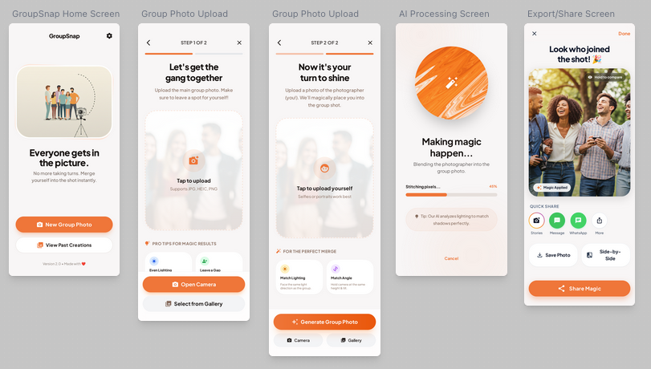

# GroupSnap



An Android app that solves the "missing photographer" problem by intelligently merging a group photo with a separate photo of the person who took it, making it appear as if everyone was in the same shot.


## Demo Videos

<table>
  <tr>
    <td align="center">
      <video src="app/designs/demo1.mp4" width="300" controls>Demo 1</video>
      <br><b>Demo 1</b>
    </td>
    <td align="center">
      <video src="app/designs/demo2.mp4" width="300" controls>Demo 2</video>
      <br><b>Demo 2</b>
    </td>
  </tr>
</table>

## Features

- **Smart Photo Merging** - Gemini Nano Banana AI-powered blending of photographer into group photos
- **Quick Share** - One-tap sharing to Stories, WhatsApp, Messages, and more
- **Before/After Compare** - Hold to compare original vs merged photo

## Designs

Designs are created with the Google Stitch https://stitch.withgoogle.com/projects/9440880816474808086

## Tech Stack

- Kotlin
- Jetpack Compose
- Material 3
- Navigation Compose
- Gemini API (for AI merging and accessing Nano Banana)

## Getting Started

1. Clone the repository
2. Get your Gemini API key from [Google AI Studio](https://aistudio.google.com/apikey)
3. Add the API key to your `local.properties` file:
   ```
   GEMINI_API_KEY=your_api_key_here
   ```
4. Open in Android Studio
5. Sync Gradle files
6. Run on device/emulator (minSdk 26)

## Project Structure

```
app/src/main/java/com/wajahatkarim/groupphotos/
├── MainActivity.kt
└── ui/
    ├── navigation/
    │   └── AppNavigation.kt
    ├── screens/
    │   ├── HomeScreen.kt
    │   ├── GroupPhotoUploadScreen.kt
    │   ├── PhotographerUploadScreen.kt
    │   ├── ProcessingScreen.kt
    │   └── ResultScreen.kt
    └── theme/
        ├── Color.kt
        ├── Theme.kt
        └── Type.kt
```

## License

Apache 2 License